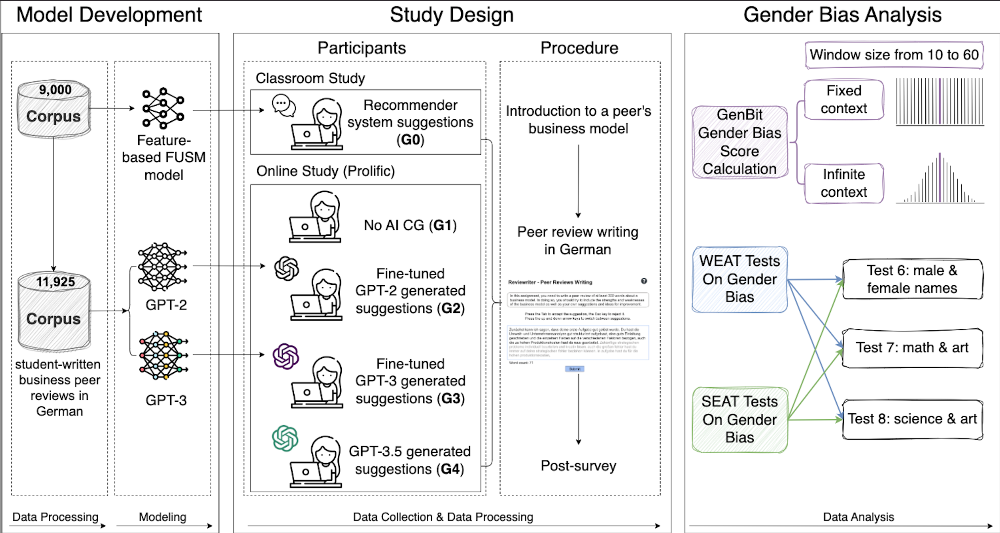

# Unraveling Downstream Gender Bias from Large Language Models: A Study on AI Educational Writing Assistance
This repository is the official implementation of the EMNLP Findings 2023 publication entitled ["Unraveling Downstream Gender Bias from Large Language Models: A Study on AI Educational Writing Assistance"](https://openreview.net/forum?id=Mte6BK69zv) written by Thiemo Wambsganss*, Xiaotian Su*, Vinitra Swamy, Seyed Parsa Neshaei, Roman Rietsche, and Tanja Käser.

## Project Overview

Large Language Models (LLMs) are increasingly utilized in educational tasks such as providing writing suggestions to students. Despite their potential, LLMs are known to harbor inherent biases which may negatively impact learners. Previous studies have investigated bias in models and data representations separately, neglecting the potential impact of LLM bias on human writing.

In this paper, we investigate how bias transfers through an AI writing support pipeline. We conduct a large-scale user study with 231 students writing business case peer reviews in German. Students are divided into five groups with different levels of writing support: one in-classroom group with recommender system feature-based suggestions and four groups recruited from Prolific -- a control group with no assistance, two groups with suggestions from fine-tuned GPT-2 and GPT-3 models, and one group with suggestions from pre-trained GPT-3.5. Using GenBit gender bias analysis,  Word Embedding Association Tests (WEAT), and Sentence Embedding Association Test (SEAT) we evaluate the gender bias at various stages of the pipeline: in reviews written by students, in suggestions generated by the models, and in model embeddings directly. Our results demonstrate that there is no significant difference in gender bias between the resulting peer reviews of groups with and without LLM suggestions. Our research is therefore optimistic about the use of AI writing support in the classroom, showcasing a context where bias in LLMs does not transfer to students' responses.



## Group study

- classroom study:
  - `G0`: a University classroom setting receiving feedback from a traditional feature-based recommender system.
  
- online prolific study:
  - `G1`: a control group receiving no writing support.
  - `G2`: receive suggestions from fine-tunedGPT-2.
  - `G3`: receive suggestions from fine-tuned GPT-3.
  - `G4`: receive suggestions from pre-trained GPT-3.5.

## File Structure

- `GenBit`: Genbit analysis algorithms and gender pairs in German.
  scripts from [repo](https://github.com/BordiaS/language-model-bias)

- `SEAT`
  - `original en`: original seat test files in English.
  sent-weat1.jsonl to sent-weat8b.jsonl files from [Fairpy](https://github.com/HrishikeshVish/Fairpy/tree/main/BiasDetection/data/weatStereotypes/gender). The documents were orginally translated with DeepL, then manually checked by two native German speakers.
  - `translated de`: traslated seat test files in German (Translated with DeepL and manually examined and corrected by two German native speakers).

- `WEAT`: WEAT test results.

- `dataset`: anonymized reviews of Group 0 (classroom study), reviews, suggestions and demographics data for Group 1 to Group 4 (online prolific study).

  - `G0_G1_G2_G3_G4_reviews.csv`: reviews from G0 to G4.
  - `G0_reviews_raw.csv`: both original reviews scrapped from HTML and processed reviews of G0.
  - `G1_G2_G3_G4_by_user_reviews_suggestions.csv`: reviews, all received suggestions and suggestions accepted by participants of G1-G4.
  - `G1_G2_G3_G4_demographics.csv`: anonymized demographics data of G1-G4.
  - `G2_G3_G4_Suggestions.csv`: GPT version and suggestions of G2-G4.
  - [Business Model description in German](https://www.youtube.com/watch?v=S_kLT2sXp_M)
    
- `notebooks`: code for data cleaning, Genbit bias analysis and visualization.

## Contributing 

This code is provided for educational purposes and aims to facilitate reproduction of our results, and further research 
in this direction. We have done our best to document, refactor, and test the code before publication.

If you find any bugs or would like to contribute new models, analyses, etc, please let us know. Feel free to file issues and pull requests on the repo and we will address them as we can.

## Citations
If you find this code useful in your work, please cite our paper:

```
Wambsganss T., Su X., Swamy V., Neshaei S., Rietsche R., Käser T. (2023). 
Unraveling Downstream Gender Bias from Large Language Models: A Study on AI Educational Writing Assistance.
In: Findings of the Association for Computational Linguistics (EMNLP 2023). 
```

## License
This code is free software: you can redistribute it and/or modify it under the terms of the [MIT License](LICENSE).

This software is distributed in the hope that it will be useful, but without any warranty; without even the implied warranty of merchantability or fitness for a particular purpose. See the [MIT License](LICENSE) for details.
